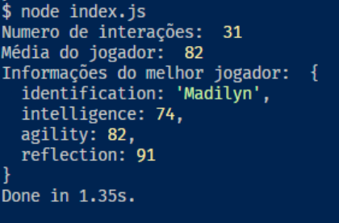

<h1 align="center">
   Algoritmo Genético 
</h1>

<h4 align="center">
   Inteligência Artificial 
</h4>

 
   

## :computer: Contextualização
O objetivo com o algoritmo genético é calcular a quantidade de gerações necessárias para se ter pelo menos um jogador bom na maioria dos jogos que exija um nível bom de características intelectuais, agilidade e ações rápidas. 

## :european_post_office: População
A população se resume em dez genes com quatro características cada: 
  - inteligência;
  - Agilidade;
  - Reflexo.

## :family: Geração & Crossover
Para iteração os novos filhos estavam sendo calculados buscamos o meio entre cada atributos dos dois pais, se por acaso algum dos atributos passe da pontuação máxima, resetamos a pontuação do atributo manipulado. 

## :microscope: Mutação
Na mutação um atributo foi aleatoriamente aumentado a partir da média entre os valores, para pode aumentar o atributos sorteado que está abaixo desta média aumentando em 10%, caso o aumento da mesma passe o limite, definimos um teto para que isto não aconteça.

## :octocat: Como executar?

Para iniciar o projeto será necessário um gerenciador de pacotes como `yarn` ou `npm` e também a instalação do node.

- Faça o clone desse repositório `git clone https://github.com/SamLucas/AlgoritimoGenetico`;
- Em seguida faça a instalação dos pacotes usando `yarn install` por exemplo;
- E inicie o projeto com o script start, exemplo: `yarn start`.

## :postbox: Contato

 Para mais informações entre em contato:

Samuel Lucas:
- [Facebook](https://www.facebook.com/samuellucassantosgomes);
- [Linkedin](https://www.linkedin.com/in/samuel-lucas-8b7297125/);

Luana Melo:
- [Facebook](https://www.facebook.com/luana.melo.961);
- [Linkedin](https://www.linkedin.com/in/luana-de-melo-pereira-853316177/);

---

Feito com ♥ by Samuel Lucas & Luana Melo.
